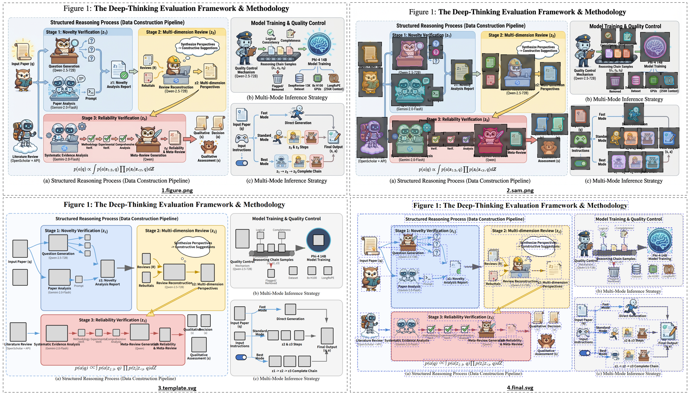
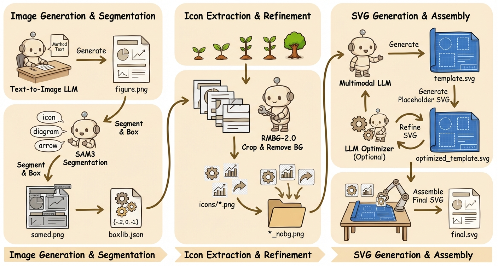
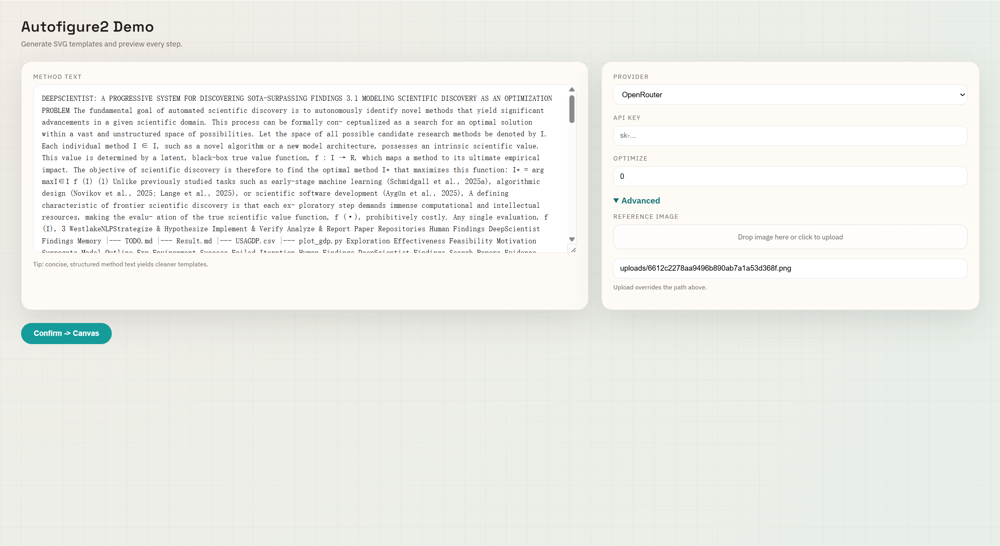
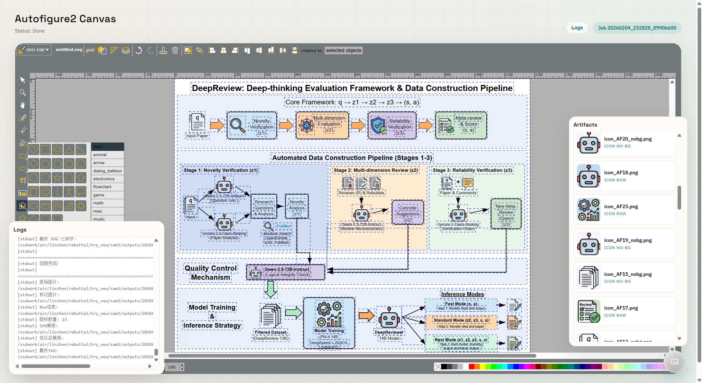

<div align="center">


# AutoFigure-edit: Generating and Editing Publication-Ready Scientific Illustrations [ICLR 2026]
<p align="center">
  <a href="README.md">English</a> | <a href="README_zh.md">中文</a>
</p>

[](https://openreview.net/forum?id=5N3z9JQJKq)
[](https://opensource.org/licenses/MIT)
[](https://www.python.org/)
[](https://huggingface.co/datasets/WestlakeNLP/FigureBench)

<p align="center">
  <strong>从方法文本到可编辑的 SVG</strong><br>
  AutoFigure-edit 是 AutoFigure 的新一代版本。它能将论文的方法部分自动转化为完全可编辑的 SVG 插图，并支持在嵌入式 SVG 编辑器中进行微调。
</p>

[快速开始](#-快速开始) • [Web 界面演示](#%EF%B8%8F-web-界面演示) • [工作原理](#-工作原理) • [配置](#%EF%B8%8F-配置) • [引用](#-引用与许可)

[[`论文`](https://openreview.net/forum?id=5N3z9JQJKq)]
[[`项目主页`](https://github.com/ResearAI/AutoFigure)]
[[`BibTeX`](#-引用与许可)]

</div>

---

## ✨ 特性

| 特性 | 描述 |
| :--- | :--- |
| 📝 **文本转插图** | 直接从方法文本生成插图草稿。 |
| 🧠 **SAM3 图标检测** | 通过多提示词检测图标区域并合并重叠部分。 |
| 🎯 **带标签占位符** | 插入一致的 AF 风格占位符，实现可靠的 SVG 映射。 |
| 🧩 **SVG 生成** | 生成与插图对齐的可编辑 SVG 模板。 |
| 🖥️ **嵌入式编辑器** | 使用内置的 svg-edit 在浏览器中直接编辑 SVG。 |
| 📦 **产物输出** | 每次运行保存 PNG/SVG 输出及裁剪后的图标。 |

---

## 🎨 画廊：可编辑矢量化与风格迁移

AutoFigure-edit 引入了两项突破性功能：

1.  **完全可编辑的 SVG（纯代码实现）：** 与位图不同，我们的输出是结构化的矢量图形（SVG）。每个组件都是可编辑的——文本、形状和布局都可以无损修改。
2.  **风格迁移：** 系统可以模仿用户提供的参考图片的艺术风格。

以下是涵盖 3 篇不同论文的 **9 个示例**。每篇论文都使用 3 种不同的参考风格生成。
*(每张图片展示：**左侧** = AutoFigure 生成的原图 | **右侧** = 矢量化后的可编辑 SVG)*

| 论文案例与风格迁移展示 |
| :---: |
| **[CycleResearcher](https://github.com/zhu-minjun/Researcher) / [Style 1](https://arxiv.org/pdf/2510.09558)**<br> |
| **[CycleResearcher](https://github.com/zhu-minjun/Researcher) / [Style 2](https://arxiv.org/pdf/2503.18102)**<br> |
| **[CycleResearcher](https://github.com/zhu-minjun/Researcher) / [Style 3](https://arxiv.org/pdf/2510.14512)**<br> |
| **[DeepReviewer](https://github.com/zhu-minjun/Researcher) / [Style 1](https://arxiv.org/pdf/2510.09558)**<br> |
| **[DeepReviewer](https://github.com/zhu-minjun/Researcher) / [Style 2](https://arxiv.org/pdf/2503.18102)**<br> |
| **[DeepReviewer](https://github.com/zhu-minjun/Researcher) / [Style 3](https://arxiv.org/pdf/2510.14512)**<br> |
| **[DeepScientist](https://github.com/ResearAI/DeepScientist) / [Style 1](https://arxiv.org/pdf/2510.09558)**<br> |
| **[DeepScientist](https://github.com/ResearAI/DeepScientist) / [Style 2](https://arxiv.org/pdf/2503.18102)**<br> |
| **[DeepScientist](https://github.com/ResearAI/DeepScientist) / [Style 3](https://arxiv.org/pdf/2510.14512)**<br> |

---
## 🚀 工作原理

AutoFigure-edit 的处理流程通过四个阶段将原始生成的位图转化为可编辑的 SVG：

<div align="center">
   SAM -> Template -> Final"/>
  <br>
  <em>(1) 原始生成 &rarr; (2) SAM3 分割 &rarr; (3) SVG 布局模板 &rarr; (4) 最终矢量合成</em>
</div>

<br>

1.  **生成 (`figure.png`):** LLM 根据方法文本生成初始的光栅化草图。
2.  **分割 (`sam.png`):** 集成 SAM3 检测并分割出独立的图标与文本区域。
3.  **模板 (`template.svg`):** 系统构建包含占位符的 SVG 结构骨架（线框图）。
4.  **合成 (`final.svg`):** 将高质量的抠图图标和矢量化文本注入模板，完成组装。

<details>
<summary><strong>点击查看技术流程详解</strong></summary>

<br>
<div align="center">
  
</div>

AutoFigure2 的流程始于论文的方法文本，首先调用 **文本生成图像 LLM (Text-to-Image LLM)** 渲染出期刊风格的示意图，保存为 `figure.png`。接着，系统使用一个或多个文本提示词（如 "icon, diagram, arrow"）对该图像运行 **SAM3 分割**，通过 IoU 阈值合并重叠的检测结果，并在原图上绘制灰底黑边的带标签框；这一步生成了 `samed.png`（带标签的掩码层）和一个包含坐标、置信度和提示词来源的结构化文件 `boxlib.json`。

随后，每个方框区域从原图中裁剪出来，并经过 **RMBG-2.0** 进行背景去除，生成位于 `icons/*.png` 和 `*_nobg.png` 的透明图标素材。系统将 `figure.png`、`samed.png` 和 `boxlib.json` 作为多模态输入，由 LLM 生成一个**占位符风格的 SVG** (`template.svg`)，其方框与标记区域相匹配。

此外，SVG 可以选择性地通过 **LLM 优化器** 进行迭代微调，以更好地对齐线条、布局和风格，生成 `optimized_template.svg`（若跳过优化则使用原始模板）。系统随后比较 SVG 与原始图像的尺寸以计算缩放因子并对齐坐标系。最后，它将 SVG 中的每个占位符替换为对应的透明图标（通过标签/ID 匹配），从而组装出最终的 `final.svg`。

**关键配置细节：**
- **占位符模式 (Placeholder Mode):** 控制图标框在提示词中的编码方式（`label`、`box` 或 `none`）。
- **优化 (Optimization):** 设置 `optimize_iterations=0` 可跳过微调步骤，直接使用生成的结构模板。
</details>

## ⚡ 快速开始

### 选项 1: 命令行 (CLI)

```bash
# 1) 安装依赖
pip install -r requirements.txt

# 2) 单独安装 SAM3 (本项目未包含)
git clone https://github.com/facebookresearch/sam3.git
cd sam3
pip install -e .
```

**运行:**

```bash
python autofigure2.py \
  --method_file paper.txt \
  --output_dir outputs/demo \
  --provider bianxie \
  --api_key YOUR_KEY
```

### 选项 2: Web 界面

```bash
python server.py
```

然后在浏览器打开 `http://localhost:8000`。

---

## 🖥️ Web 界面演示

AutoFigure-edit 提供了一个可视化的 Web 界面，旨在实现无缝的生成和编辑体验。

### 1. 配置页面


在起始页面左侧粘贴论文的方法文本。在右侧配置生成选项：
*   **供应商 (Provider):** 选择 LLM 供应商（OpenRouter 或 Bianxie）。
*   **优化 (Optimize):** 设置 SVG 模板的优化迭代次数（日常使用建议设为 `0`）。
*   **参考图片 (Reference Image):** 上传目标图片以启用风格迁移功能。
*   **SAM3 后端:** 选择本地 SAM3 或 fal.ai API（API Key 可选）。

### 2. 画布与编辑器


生成结果会直接加载到集成的 [SVG-Edit](https://github.com/SVG-Edit/svgedit) 画布中，支持全功能的矢量编辑。
*   **状态与日志:** 左上角查看实时进度，右上角按钮查看详细执行日志。
*   **素材抽屉 (Artifacts):** 点击右下角的悬浮按钮展开 **素材面板**。这里包含所有中间产物（图标、SVG 模板等）。你可以直接将任何素材 **拖拽** 到画布上进行自定义创作。

---

## 🧩 SAM3 安装说明

AutoFigure-edit 依赖 SAM3，但本项目**未**直接包含它。请遵循官方 SAM3 安装指南和先决条件。上游仓库目前针对 GPU 构建要求 Python 3.12+、PyTorch 2.7+ 和 CUDA 12.6。

SAM3 权重文件托管在 Hugging Face 上，下载前可能需要申请访问权限并进行认证（例如 `huggingface-cli login`）。

- SAM3 仓库: https://github.com/facebookresearch/sam3
- SAM3 Hugging Face: https://huggingface.co/facebook/sam3

### SAM3 API 模式（无需本地安装）

如果您不想在本地安装 SAM3，可以使用 API 后端（Web Demo 也支持）。**我们推荐使用 [Roboflow](https://roboflow.com/)，因为它可以免费使用。**

**方案 A: fal.ai**

```bash
export FAL_KEY="your-fal-key"
python autofigure2.py \
  --method_file paper.txt \
  --output_dir outputs/demo \
  --provider bianxie \
  --api_key YOUR_KEY \
  --sam_backend fal
```

**方案 B: Roboflow**

```bash
export ROBOFLOW_API_KEY="your-roboflow-key"
python autofigure2.py \
  --method_file paper.txt \
  --output_dir outputs/demo \
  --provider bianxie \
  --api_key YOUR_KEY \
  --sam_backend roboflow
```

可选 CLI 参数（API）：
- `--sam_api_key`（覆盖 `FAL_KEY`/`ROBOFLOW_API_KEY`）
- `--sam_max_masks`（默认 32，仅 fal.ai 后端）

## ⚙️ 配置

### 支持的 LLM 供应商

| 供应商 | Base URL | 备注 |
|----------|----------|------|
| **OpenRouter** | `openrouter.ai/api/v1` | 支持 Gemini/Claude/其他模型 |
| **Bianxie** | `api.bianxie.ai/v1` | 兼容 OpenAI 接口 |

常用 CLI 参数：

- `--provider` (openrouter | bianxie)
- `--image_model`, `--svg_model`
- `--sam_prompt` (逗号分隔的提示词)
- `--sam_backend` (local | fal | roboflow | api)
- `--sam_api_key` (API Key，默认读取 `FAL_KEY` 或 `ROBOFLOW_API_KEY`)
- `--sam_max_masks` (fal.ai 最大 masks，默认 32)
- `--merge_threshold` (0 禁用合并)
- `--optimize_iterations` (0 禁用优化)
- `--reference_image_path` (可选)

---

## 📁 项目结构

<details>
<summary>点击展开目录树</summary>

```
AutoFigure-edit/
├── autofigure2.py         # 主流水线
├── server.py              # FastAPI 后端
├── requirements.txt
├── web/                   # 静态前端
│   ├── index.html
│   ├── canvas.html
│   ├── styles.css
│   ├── app.js
│   └── vendor/svg-edit/   # 嵌入式 SVG 编辑器
└── img/                   # README 资源
```
</details>

---

## 🤝 社区与支持

**微信交流群**  
扫描二维码加入我们的社区。如果二维码过期，请添加微信号 `nauhcutnil` 或联系 `tuchuan@mail.hfut.edu.cn`。

<table>
  <tr>
    <td></td>
    <td></td>
  </tr>
</table>
---

## 📜 引用与许可

如果您觉得 **AutoFigure** 或 **FigureBench** 对您有帮助，请引用：

```bibtex
@inproceedings{
zhu2026autofigure,
title={AutoFigure: Generating and Refining Publication-Ready Scientific Illustrations},
author={Minjun Zhu and Zhen Lin and Yixuan Weng and Panzhong Lu and Qiujie Xie and Yifan Wei and Yifan_Wei and Sifan Liu and QiYao Sun and Yue Zhang},
booktitle={The Fourteenth International Conference on Learning Representations},
year={2026},
url={https://openreview.net/forum?id=5N3z9JQJKq}
}

@dataset{figurebench2025,
  title = {FigureBench: A Benchmark for Automated Scientific Illustration Generation},
  author = {WestlakeNLP},
  year = {2025},
  url = {https://huggingface.co/datasets/WestlakeNLP/FigureBench}
}
```

本项目基于 MIT 许可证开源 - 详见 `LICENSE` 文件。
